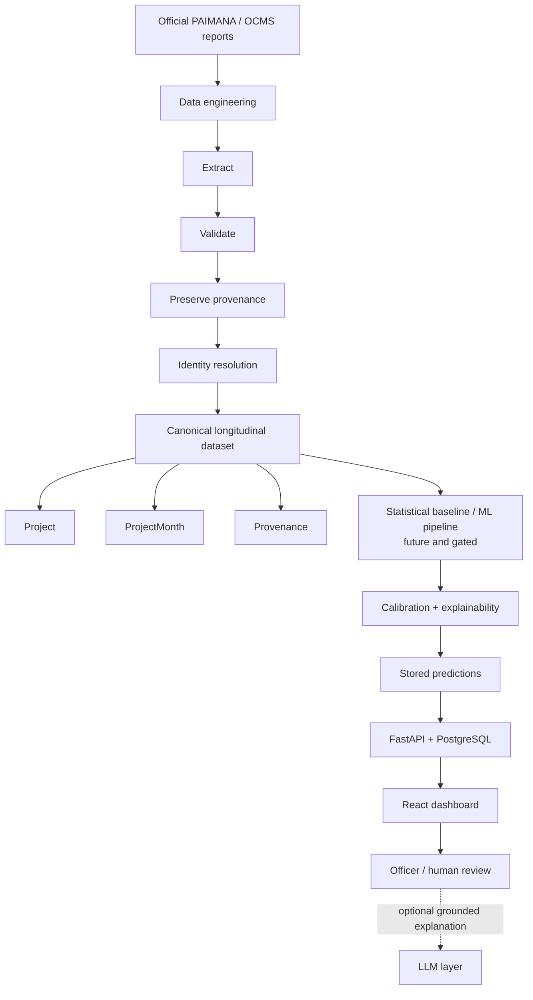

# PRAHARI

**Explainable, confidence-aware early-warning research for public infrastructure monitoring**

PRAHARI is an evidence-first decision-support initiative for **Smart India Hackathon problem statement SIH26103**. It is designed to complement MoSPI/IPMD's PAIMANA and OCMS monitoring ecosystem by reconstructing trustworthy project histories before testing whether cost and schedule deterioration can be anticipated.

> **Current maturity — Gate 2: Data Engineering / Longitudinal Dataset Construction.**<br>
> May and June 2026 extraction and the two-month longitudinal pilot are validated. Outcome labels, ML features, prediction models, risk scores, APIs, and dashboards are not yet implemented or validated.

## The problem

Central Sector Infrastructure Project monitoring contains rich monthly evidence about project identity, cost, schedule, implementation progress, and expenditure. A monthly report describes the state reported at that moment; an early-warning system additionally needs to reconstruct what changed over time, what was knowable at each date, and how reliable any forward-looking signal is.

That is difficult because source reports span changing schemas, repeated projects, revised values, missing identifiers, and pagination conventions. A model trained before those issues are controlled can learn leakage, confuse revisions with outcomes, or produce alerts that cannot be traced to official evidence.

PRAHARI therefore starts with a narrower, testable question:

> Can official reporting be transformed into a provenance-preserved longitudinal dataset strong enough to support a fair comparison of operational rules, conventional statistics, and machine learning?

## What PRAHARI is building

The intended system separates four concepts that are often collapsed into one score:

1. **Current status** — what the source currently reports.
2. **Forward risk** — a future probability, defined over an explicit horizon.
3. **Confidence / reliability** — how much trust the evidence and model warrant.
4. **Administrative priority** — a policy and workflow decision, not a model output alone.

A project already delayed is not automatically the project most likely to deteriorate further. Likewise, an unusual month-to-month change is evidence for review—not proof of error, completion, or risk.

PRAHARI is intended to complement PAIMANA, not replace it. It is not a project-entry system and will not automate government action. Human review remains part of the decision path.

## Design principles

- **Evidence before prediction.** ML remains gated until source truth, identity, targets, and leakage controls are validated.
- **Provenance by construction.** Every usable observation must resolve to a source report, page, table, and verified file hash.
- **Immutable source evidence.** Raw PDFs are inputs, never rewritten pipeline outputs.
- **Temporal honesty.** Every candidate feature must pass: *Was this information known at date T?*
- **Preserve before interpreting.** Source fields and unusual decreases are retained; normalization and diagnostics do not overwrite history.
- **Conservative identity.** Exact identifiers are preferred. Unmatched records are not automatically called new or completed, and fuzzy matches are never silently accepted.
- **Explainability is not confidence.** An explanation describes model behavior; confidence must come from evidence such as calibration, completeness, freshness, history depth, model agreement, and distribution shift.
- **Human accountability.** Predictions may inform review; they do not determine administrative action.

## Architecture



The planned backend serves validated canonical data and, later, persisted batch predictions. It does not extract raw PDFs during API requests. The frontend presents evidence; it does not calculate risk. Any future LLM is downstream and grounded—it is never the predictor.

## Current implementation status

| Capability | Status | Current evidence |
|---|---|---|
| Source registry, SHA-256 checks, raw-file controls | **Validated foundation** | Manifest, source registry, PDF audit, automated tests |
| Schema and table-boundary detection | **Validated for current sources** | May/June PAIMANA V2 extraction specifications and tests |
| May 2026 Table 6 extraction | **Validated** | Canonical source, extraction report, provenance |
| June 2026 Table 6 extraction | **Validated** | 30/30 manual sample and adversarial extractor review |
| May ↔ June identity continuity | **Validated pilot** | Exact Project Code analysis; no conflicts or duplicates |
| `project_master` + `project_month` | **Validated two-month pilot** | Deterministic build and validation artifacts |
| Broader historical reconstruction | **Gated** | Additional canonical months and schema-era validation required |
| Outcome labels and completion events | **Not started** | Gate 3 work; no labels inferred in the pilot |
| Features, models, predictions, risk scores | **Not started** | Gates 4–6 |
| FastAPI, PostgreSQL, React dashboard | **Planned** | Architecture direction only |

### Validated Gate 2 results

| Scope | Result |
|---|---:|
| May 2026 ongoing-project observations | **1,987** |
| June 2026 ongoing-project observations | **1,847** |
| Exact one-to-one May ↔ June Project Code matches | **1,825** |
| May-only / June-only observations | **162 / 22** |
| June observations with a direct May counterpart | **98.81%** |
| Unique projects in the two-month pilot | **2,009** |
| Project-month observations | **3,834** |

Project Code is complete and unique within both monthly extracts. The continuity analysis found no Project Code duplicates and no identity conflicts. Internal project IDs are deterministic: `PRH-<Project Code>`.

The pilot preserves complete source provenance and creates **no inferred completion labels, ML labels, ML features, predictions, or risk scores**.

Observed temporal diagnostics include 6 name changes, 577 agency-label changes, 3 approval-date changes, 21 start-date changes, 6 original-cost changes, 7 revised-cost changes, 319 revised-date-of-completion changes, 19 progress decreases, and 38 expenditure decreases. Eighty-eight rows were selected for deterministic review. These counts are diagnostics only; they are not automatically interpreted as source errors or project risk.

See the [May extraction report](outputs/reports/may_2026_extraction_report.md), [June extraction report](outputs/reports/june_2026_extraction_report.md), [identity continuity report](outputs/reports/may_june_2026_identity_continuity_report.md), and [longitudinal pilot report](outputs/reports/may_june_2026_longitudinal_pilot_report.md).

## Longitudinal data model

The analytical unit is **project × reporting month**.

```text
Project (one stable infrastructure project)
  └── ProjectMonth (one observed monthly state)
        └── Provenance (source report, SHA-256, table and page evidence)
```

| Entity | Purpose | Current state |
|---|---|---|
| `Project` / `project_master` | Stable identity and project-level attributes | Two-month pilot |
| `ProjectMonth` / `project_month` | Time-indexed facts as reported in each month | Two-month pilot |
| `SourceReport` + `Provenance` | Source identity, hash, page, table, and extraction lineage | Implemented |
| `ProjectIdentifier` | Explicit mapping among source identifiers | Architecture direction |
| `CompletionEvent` | Audited outcome evidence | Future, Gate 3 |
| `Prediction`, `ModelMetadata`, `Explanation`, `Alert` | Versioned future decision-support outputs | Future and gated |

One project may have many monthly observations. A later report never overwrites an earlier historical fact.

## Planned prediction research

Prediction is a research plan, not a completed capability. Candidate cost- and schedule-risk targets may use 3-, 6-, and 12-month horizons, but their definitions must first survive the outcome/label audit.

The planned comparison ladder is:

1. Rule-based or operational baseline.
2. Conventional statistical model.
3. Interpretable machine learning.
4. Stronger tree-based models only where evidence justifies the added complexity.

Evaluation is expected to use project-grouped, time-aware, and out-of-time splits. Candidate measures include PR-AUC, ROC-AUC where informative, Brier score, calibration, false-alert burden, and useful lead time. The repository will not treat discrimination alone as sufficient for operational use.

A planned ablation asks whether predictive evidence improves across:

- **A — CUF-only**
- **B — CUF + temporal features**
- **C — CUF + external variables**

This is a future comparison. No CUF fields, external variables, or performance results are asserted here without validated data.

## Explainability and reliability

Future predictions should carry versioned evidence: model identity, prediction date and horizon, contributing observations, explanations, and calibration context. Reliability should be evaluated using validated signals such as data completeness, source freshness, history depth, calibration, model agreement, and out-of-distribution behavior—not an arbitrary confidence formula.

Explanations answer *why a model produced an output*. Calibration and data-quality evidence answer *how much reliance that output warrants*. PRAHARI keeps those questions separate.

## Backend and frontend direction

The planned backend is a **FastAPI modular monolith** backed by **PostgreSQL**, **SQLAlchemy**, and **Alembic**, with a clear `API → Service → Repository → Database` flow. It will serve canonical validated data and later persist batch-generated predictions; models will not be loaded afresh for each frontend request.

The planned **React** interface is organized around an officer's review workflow:

- project explorer and history;
- portfolio-level analysis;
- visible source provenance;
- future prediction and evidence views, once validated;
- explanation and reliability context; and
- recorded human review.

Neither layer is represented as complete in the current repository.

## Technology stack

| In use now | Planned after the relevant gate |
|---|---|
| Python, pandas | FastAPI |
| pdfplumber, PyMuPDF | PostgreSQL |
| pytest | SQLAlchemy, Alembic |
| GitHub Actions | React |
| CSV-based validated artifacts | Parquet for analytical workloads, if justified |

## Repository structure

```text
PRAHARI/
├── config.yaml                 # Pipeline and path configuration
├── data/
│   ├── raw/                    # Immutable source PDFs (local evidence)
│   ├── extracted/              # Source-faithful monthly extraction
│   ├── processed/              # Validated analytical pilots
│   └── metadata/               # Manifest, provenance, dictionary
├── docs/
│   ├── team/                   # Individual research and ownership
│   ├── shared/                 # Canonical team decisions and contracts
│   ├── reference/              # Common source/domain evidence
│   └── extraction/             # Frozen extraction specifications
├── src/
│   ├── extraction/             # PDF inspection and extraction
│   ├── identity/               # Cross-month identity continuity
│   ├── pipeline/               # Source registry and orchestration
│   └── validation/             # Data-quality and provenance rules
├── scripts/                    # Audits, deterministic builds, verifiers
├── tests/                      # Automated unit and integration tests
├── validation/                 # Human and automated validation artifacts
├── outputs/reports/            # Evidence-backed technical reports
└── .github/                    # Review templates, ownership, CI
```

## Documentation as a knowledge system

This repository treats documentation as technical infrastructure:

- [`docs/team/`](docs/team/) records responsibility-specific research.
- [`docs/shared/`](docs/shared/) contains canonical decisions, contracts, gate state, and dependencies.
- [`docs/reference/`](docs/reference/) holds official or common evidence.
- [`docs/extraction/`](docs/extraction/) defines source-specific extraction behavior.
- [`validation/`](validation/) holds reproducible manual and automated review evidence.

Start with the [documentation index](docs/README.md), then read the [project overview](docs/shared/PROJECT_OVERVIEW.md), [data contract](docs/shared/DATA_CONTRACT.md), [current technical hypothesis](docs/shared/CURRENT_TECHNICAL_HYPOTHESIS.md), and [gate status](docs/shared/GATE_STATUS.md).

## Reproduce the current checks

### 1. Create an isolated environment

```bash
python -m venv .venv
```

Activate it with `.venv\Scripts\activate` on Windows or `source .venv/bin/activate` on Linux/macOS, then install the locked Gate 2 environment:

```bash
python -m pip install -r requirements-lock.txt
```

### 2. Run documentation and automated validation

```bash
python scripts/validate_docs.py
python -m pytest
```

For the faster CI-compatible suite without integration tests:

```bash
python -m pytest -m "not integration"
```

### 3. Verify local source evidence

The following checks require the canonical PDFs in `data/raw/` and metadata registered for the local repository:

```bash
python scripts/verify_gate2_foundation.py
python scripts/audit_all_pdfs.py
```

Raw source reports may not be distributed with every clone. A missing local PDF is not permission to substitute a similarly named file; register and hash the canonical source first.

## Development and contribution workflow

1. Work only within the active gate and its documented contract.
2. Add evidence before promoting a claim or changing canonical behavior.
3. Preserve raw inputs and existing historical observations.
4. Add deterministic tests and validation artifacts for data-changing work.
5. Run documentation validation and the relevant test suite.
6. Submit a focused pull request using the repository template and ownership rules.

Empirical claims use four evidence states:

| State | Meaning |
|---|---|
| `VERIFIED` | Directly demonstrated by source, data, code, and required review |
| `PLAUSIBLE` | Reasonable, but not yet demonstrated |
| `UNKNOWN` | Evidence is insufficient |
| `REJECTED` | Tested and found invalid |

Do not promote `PLAUSIBLE` to `VERIFIED` without reviewable evidence. New extractors, identity rules, labels, and features should remain narrow until their source-specific behavior is validated.

## Data integrity and reproducibility

- Raw PDFs are immutable and excluded from generated-output writes.
- The source manifest records source identity, eligibility, metadata, and SHA-256 hashes.
- Hash checks detect substitution or post-registration changes.
- Extraction retains source fields before normalization and records physical/printed page context where applicable.
- Provenance connects every trusted row to its source evidence.
- Deterministic IDs, ordering, and samples make audits repeatable.
- Decreases, revisions, and unmatched observations are preserved for review rather than silently corrected or semantically relabeled.
- Duplicate or rejected sources do not become eligible because of a filename.
- Fuzzy identity candidates require review; they are not auto-accepted.
- Labels, features, and models remain gated until target truth and temporal leakage controls are validated.

## Roadmap

The canonical repository currently defines six research gates:

| Gate | Objective | Status |
|---|---|---|
| **1** | Problem definition and architecture research | **Complete** |
| **2** | Data engineering and longitudinal dataset | **Active** |
| **3** | Outcome / label audit | Not started |
| **4** | Leakage-safe feature engineering | Not started |
| **5** | Rules vs statistics vs ML evaluation | Not started |
| **6** | Early-warning system evaluation | Not started |

Gate 2 next requires broader canonical source coverage and historical/schema-era validation. Gate 3 must establish auditable outcomes before any supervised modeling. Backend, dashboard, decision-support integration, and a final demonstration follow the research gates; they are product directions rather than invented numbered gates.

## Current limitations

- The validated longitudinal evidence covers only May and June 2026; it is a pilot, not a historical production dataset.
- July 2026's canonical report has not been obtained; a misleading duplicate was explicitly rejected.
- Cross-era schema behavior and broader identity continuity are not yet validated.
- The longitudinal deterministic review sample still requires its documented human audit where noted by the pilot artifacts.
- Missing and changed values describe reported evidence; their real-world causes are not inferred automatically.
- No completion outcomes, prediction targets, feature set, model performance, calibration results, alert thresholds, API, database, or dashboard are claimed.

## Team responsibilities

| Team member | Documented responsibility |
|---|---|
| **Sandarbh** | Data Engineering + ML Integration + technical integration ownership |
| **Pavitra** | Prediction formulation + targets + statistical/ML evaluation + independent data audit |
| **Akshita** | Domain research + PAIMANA gap analysis + product differentiation + adversarial/domain validation |
| **Jashndeep** | Backend architecture + database + FastAPI + data serving |
| **Sanskaar** | UX/frontend + officer workflow + dashboard information architecture |

## Project maturity notice

PRAHARI is an active SIH research and engineering project. Current verified claims concern source integrity, two monthly extractions, identity continuity, provenance, and a two-month longitudinal pilot. The project is **not production-ready, government-deployed, or a validated predictive system**. Any future risk output must be treated as decision support, accompanied by evidence and reliability context, and reviewed by an authorized human.

---

**PRAHARI · SIH26103 · Evidence first, prediction second.**
